#Allgemein
##Algorithmus
Eine Anleitung zur Lösung einer Aufgabenstellung, die so präzise Formuliert ist, dass sie mechanisch ausgeführt werden kann.

###Determiniertheit
Identische Einfgaben führen stetes zu identischen Ergebnissen

###Determinismus
Ablauf des Verfahrens ist an jedem Punkt fest vorgeschrieben (keine Wahlfreiheit)

###Terminierung
Für jede Eingabe liegt Ergenis nach endlich vielen Schritten vor.

###Effizient
Wirtschaftlichkeit des Aufwands relativ zu einem vorgegeben Massstab

##Korrektheit von Programmen
Ein Programm wird als korrekt bezeichnet, wenn unter der Annahme, dass die Vorbedingung erfüllt ist, unter Anwendung des Programms die Nachbedingung erfüllt wird.

Vorbedingung -> f(x) -> Nachbedingung

##Reference Types in Java
- Arrays
- alle Object abgeleiteten
- String
- Variablen sind nur Referenzen (Zeiger auf Objekte im Speicher)

#ADT / Stacks / Queues

ADT = Abstrakte Datentypen

##Stacks
- Speichert Objekte als Stapel
- **Push** legt neue Objekte oben auf den Stapel
- **Pop** gibt oberstes Objekt wieder zurück
- **LIFO** Last in first out Datenstrucktur

Anwendungszwecke

- Auswertung von Postfix Ausdrücken (HP)
- Test auf korrekte Klammersetzung
- XML Check

##Vererbung vs Delegation
**Vererbung**:	erbende Klase ist eine echte Erweiterung

**Delegation** andere Klasse wird ledigitlich verwendet, teile der Verarbeitung werden delegiert

##Queues
- Werden mit Listen oder Arrays implementiert
- FIFO (First in first out)
- enque
- deque
- Anwendungszwecke (Warteschlangen)

###PriortiyQueues
- Objekte hoher Priorität wandern nach vorne
- Objekte gleicher Priorität werden in derselben Reihenfolge entfernt wie sie eingefügt wurden.
- Anwendungszwecke: (Scheduling von Prozessen, Aufgabenliste nach Prioritäten)

#Listen
- Grundlegende Datenstrucktur
- java.util.List (Interface), java.util.LinkedList (implementation)
- Anwendungszwecke / Eigenschaften
	- Stack, Queue
	- Disk-Blöcke, Prozesse, Threads
	- Anzahl der Elemente zur ERstellungszeit offen
	- Reihenfolge, position ist relevant
- Funktioniert mit zeigern
	- Attribute der Nodes: next, data
	- LinkedList Attribut first
- Werden mit Iterator traversiert
	- ADT mit dem eine Datenstruktur traversiert werden kann, ohne dass die Datenstruktur bekannt gemacht werden muss
- Einfügen funktioniert durch umhängen der Zeiger next zwischen zwei Elementen
- Entfernen funktioniert auch durch umhängen der Zeiger a.next = a.next.next

##Doppelt verkettete Listen
Probleme von einfach verketeten Listen
Zugang zum Listenende kostete viel Zeit
Man kann sich nur effizient in eine Richtung bewegen

Doppelt verkette Listen
ListNode next, prev
Jeder Knoten hat zwei Referenzen next und previous
Add bei doppelt verketten Listen
###Add()
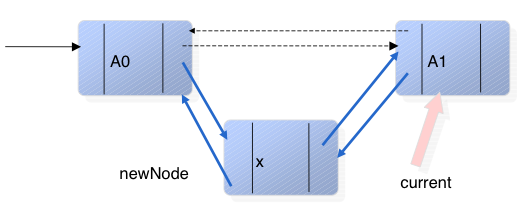

	newNode.next = current;
	newNode.prev = current.prev;
	current.prev.next = newNode;
	current.prev = newNode;
###Remove()

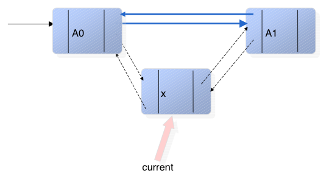

	current.prev.next = current.next;
	current.next.prev = current.prev;
	current = current.next;

### Zirkular verkettete Liste
- Next des letzten zeigt auf head (erstes)
- Previous des ersten zeigt auf tail (letztes)
- Effekt: Einziger spezialfall ist eine elere Liste

### Sortierte Listen
- Verwenden Comparator um bei Insert das Objekt an der richtigen Stelle einzufügen

###Liste Sortieren
Sofern das Listenobjekt Comparable implementiert, kann mit dieser Methode die Liste sortiert werden.

	Collections.sort(List list);
Folgende Objekte implementieren bereits Comparable:

Byte, Character, Double, File, Float, Long, ObjectStreamField, Short, String, Integer, BigInteger, BigDecimal, Date

Alternativ kann auch mittels eines Comparators verglichen werden. Der Comparator implementiert das Comaprator interface.

	Collections.sort(List list, Comparator comp);

###Array VS Liste
####Array

(+) Benutzung sehr einfach 
(+) direkter Zugriff a[5] sehr effizient 
(-) Grösse muss vor erstellen bekannt sein 

####Liste
(-) Schwieriger in der Benutzung 
(-) nur Referenztypen können in Listen verwaltet werden 
(-) Indizierter Zugriff ineffizient list.get(i) 
(+) Anzahl Elemente muss nicht bekannt sein 
(+) Anfügen, Ersetzen, Vertauschen, Einfügen und Löschen sehr effizient

### Array implementation der Liste (ArrayList)

**LinkedList**
- schneller für Mutationen, langsam bei direktem Zugriff
- non-synchronized Aufrufe

**ArrayList**
- Implementation als Array
	- direkter Zugriff schnell
	- Mutationen (einfügen, löschen) langsam
- non-synchronized Aufrufe

##Sets
Definition: eine ungeordnete Menge ohne Duplikate

###Implementation durch
- Hashset bei grossen Datenbeständen (etwas) effizienter
- TreeSet speichert die Elemente in alphabetischer (geordneter) Folge

Code implementation

	Set stooges = new HashSet();
	stooges.add("Larry");
	stooges.add("Moe");
	stooges.add("Curly");
	stooges.add("Moe"); // Duplicate wont be added
	stooges.add("Shemp");
	stooges.add("Moe"); // Duplicate wont be added
	System.out.println(stooges);

###Vergleiche von 2 Sets (A und B)
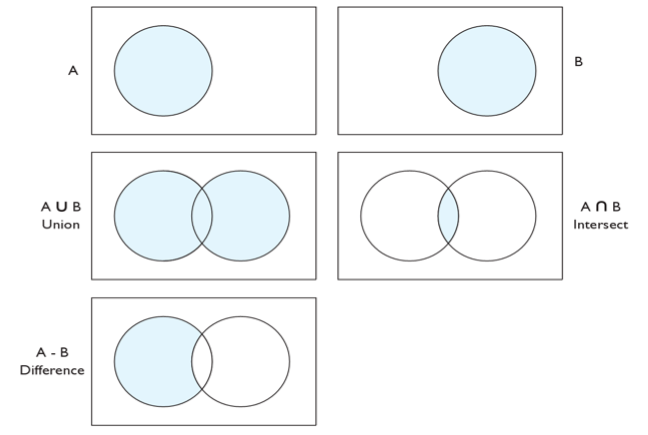

##Collection Interface
Gemeinsames Interface für Sammlungen (Collections) von Objekten - Ausnahme Array - leider.

Statische Funktionen die über **Collections.METHODNAME** aufgerufen werden können

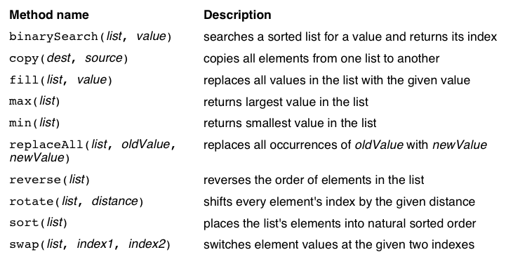

Collections.unmodifiableList gibt die Unmodifizierbare Liste (ReadOnly zurück) 
Collections.synchronizedList() gibt die ThreadSafe Liste zurück.

Per Default sind alle Collection Klassen Thread Unsafe



#Generics

Defintion:
Einen Algorithmus, der auf Werte von unterschiedlichen Datentypen angewandt werden kann, nennt man generisch.

	List<Integer> list = new LinkedList<Integer>();
	list.add(new Integer(99)); // oder dank Boxing: list.add(99);
	Integer i = list.get(0); // oder dank Unboxing: int i = list.get(0);
	list.add(new Double(3.1415)); -->Compile-Error
	list.add(new Object()); --> Compile Error

##Generic Klasse
	class LinkedList<T> {
	    public LinkedList(T item) {
	      // Code
	    }

	    public LinkedList(T[] items) {
		  // Code
	    }

	    public T getFirst() {
	  	  // Code
	    }
	}

##Extends

	public void drawAll(List<? extends Figure> figures) {
##Oberklasse festlegen

	public void addRectangle (List<? super Rectangle> shapes) {
##Bounded Wildcards

	public static <T, S extends T> void copy(List<T> est, List<S> src) {

##Wildcards bei Rückgabe

	public List<? extends Number> getValueList () { }
##Erasures
Zur laufzeit werden die Typeninformationen vollständig entfernt. Aus Box<T> wird Box<Object>.
Keine Typenprüfung möglich if (e instanceof List<LinkedList>).
Beim Ablauf des Programms kann nicht mehr von z.B. LinkedList<String> und LinkedList<Integer> unterschieden werden.
Beide habe zur Laufzeit den Typ LinkedList

#Rekursion
##Definition
Ein Algorithmus/Datenstruktur heisst rekursiv definiert, wenn er/sie sich selbst als Teil enthält oder mit Hilfe von sich selbst definiert ist.
###Direkt / indirekt
Bei der direkten Rekursion ruft sich eine Methode selbst wieder auf, bei der indirekten Rufen sich 2 Methoden gegenseitig auf (ungewollt).

###Iterativ vs Rekursiv

####Iterativ
	int anzahlSchritte() {
		int anzahl = 0;
 		while (vorn_frei()) {
			vor();
			anzahl++;
		}
		return anzahl;
	}
####Rekursiv
	int anzahlSchritteR() {
		if (vorn_frei()) {
			vor();
			return 1 + anzahlSchritteR();
		} else
			return 0;
		}
	}
###Zusammenfassung
- Zu jedem rekursiven Algorithmus gibt es einen äquivalenten iterativen Algorithmus
- (+) kürzere Formulierung
- (+) Einsparung von Variablen
- (+) Teilweise sehr effiziente Problemlösung (Quicksort)
- (-) weniger effizientes Laufzeitverhalten (overhead beim Methodenaufruf)
- (-) gewöhnungsbedürftig

#Bäume
##Begriffe
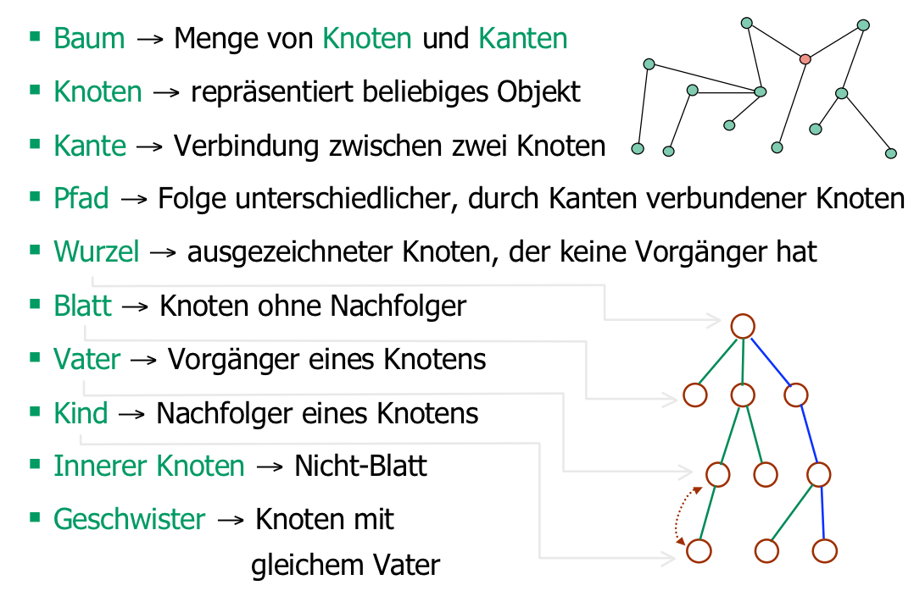

- Die Tiefe eines Baumes gibt an, wie weit die "tiefsten" Blätter von der Wurzel entfernt sind: Anzahl Kanten + 1
- Das Gewicht ist die Anzahl der Knoten des (Teil-) Baumes

##Binärbäume
Die am häufigsten verwendete Art von Bäumen: beim Binärbaum hat ein Knoten maximal 2 Nachfolger

###Berechnung der nötigen Tiefe:
ln(10)/ln(2) (Aufrunden)
Maximale Anzahl
(2^k)-1 (k = tiefe)

###Traversieren

####Klassen zur Traversierung
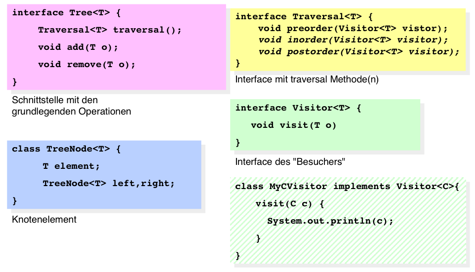

####Preorder (Oben nach Unten, Tiefensuche)
- Besuche die Wurzel
- Traversiere Links
- Traversiere Rechts

Code

	private void preorder(TreeNode<T> node, Visitor<T> visitor) { if (node != null) {
		visitor.visit(node.element);
		preorder(node.left,visitor);
		preorder(node.right,visitor);
	}

####Postorder (Unten nach Oben)
- Traversiere den linken Teilbaum (in Postorder)
- Traversiere den rechten Teilbaum (in Postorder).
- Besuche die Wurzel

Code

    private void postorder(TreeNode<T> node, Visitor<T> visitor) {
        if (node != null) {
            postorder(node.left,visitor);
            postorder(node.right,visitor);
            visitor.visit(node.element);
        }
    }

####Inorder (Links nach rechts)

- Traversiere den linken Teilbaum (in Inorder)
- Besuche die Wurzel
- Traversiere den rechten Teilbaum (in Inorder)

Code

    private void inorder(TreeNode<T> node, Visitor<T> visitor) {
        if (node != null) {
            inorder(node.left,visitor);
            visitor.visit(node.element);
            inorder(node.right,visitor);
        }
    }

####Levelorder (Breitensuche)
Beginnend bei der Baumwurzel werden die Ebenen von links nach rechts durchlaufen

- zuerst die Wurzel
- dann die Wurzel des Linken und rechten Teilbaumes
- dann die nächste Schicht

###Sortierte Bäume
- im linken Unterbaum sind alle kleineren Elemente KL <=* k
- im rechten Unterbaum sind alle grösseren Elemente: KR >* k

####Einfügen
Beim Einfügen muss links eingefügt werden, wenn das neue Element kleiner oder gleich ist, sonst rechts (rekursiv)

####Löschen
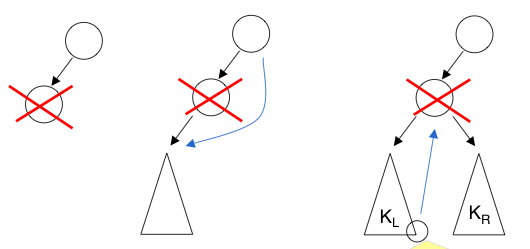

- der Knoten hat keinen Teilbaum
	- Knoten löschen
- der Knoten hat einen Teilbaum
	- Vater des zu löschenden an Kind des zu löschenden hängen
- der Knoten hat zwei Teilbäume
	- Vom linken Teilbaum wird das Element ganz rechts als Ersatz genommen
	- Dann gilt immer noch die Bedingung KL <=k und KR > k

#Sortiere Bäume / Suchen

##Zugriffszeiten
- Die Zugriffszeit (Such- und Einfügezeit) von Elementen ist proportional zur Tiefe des Baumes
- Probleme
	- neue Knoten können nur unten angehägt werden
	- bei unglücklicher Reihenfolge entstehen sehr ungleichmässige d.h. unbalancierte bäume
- Minimale Tiefe des Baumes log2(n+1)
- Bei einem vollen Binärbaum müssen lediglich ~ Log2 #Elemente Schritte durchgeführt werden bis Element gefunden wird.
- Sehr effizient wenn gut verteilt
- Im Worst case degeneriert der Baum zur Liste

##Ausgeglichenheit
- AVL- Ausgeglichenheit: Vollständig ausgeglichen: die Gewichte der beiden Teilbäume unterscheiden sich maximal um 1
- Beim Einfügen und Löschen wird die AVL Ausgeglichenheit beibehalten
- (+) Suchen ist schnell O(log(n)
- (-) Einfügen und Löschen ist komplizierter

##Rotation
- Zum Wiederherstellen der Ausgleichsbedingung werden sog. Rotationen eingesetzt

###Einzelrotation
Gewisse Konstelationen sind nach einzelrotation noch nicht balanciert, weshalb eine Doppelrotation nötig ist.
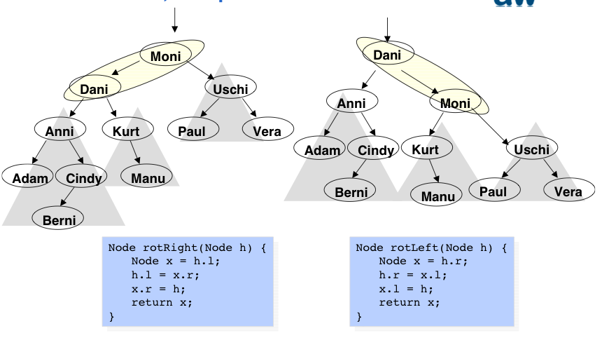

###Doppelrotation
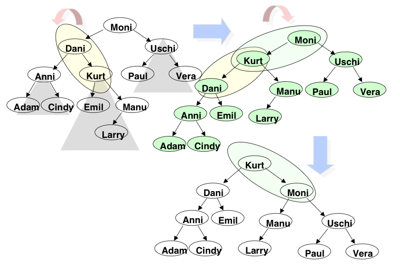

##B-Bäume
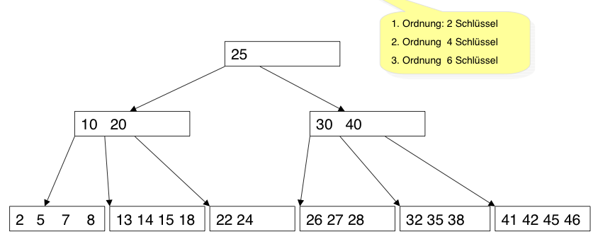

- Binär-Bäume gut für Strukturen im Hauptspeicher (RAM)
- Schlecht für Daten auf Disk
	- Random Zugriffe sind sehr langsam
- Idee: Baum so aufbauen, dass die wahlfreien Zugriffe auf Disk Blöcke minimiert werden
	- möglichst viele Informationen pro Diskblock
	- möglichst breiter Baum => Geringe Tiefe
	- gleich grosse Knoten
	- Baum ist immer ausgeglichen
- Benannt nach Rudolf Bayer
- Werden beim Einfügen / Löschen automatisch balanciert
- jeder Knoten ausser der Wurzel hat mindestens n/2 und max n schlüssel
- jeder Knoten ist entweder ein Blatt oder hat m+1 Nachfolger m = Anzahl Elemente im Knoten
- Anwendung: Organisation der Daten auf Disk mit fester Blockgrösse, z.B. Windows NTFS-Filesystem.
- mit wenigen Diskzugriffen kann ein bestimmter Datensatz gefunden werden. O(log N)
- Indexe in Datenbanken
- Für Schlüssel und Verweise gilt
	- Innerhalb eines Knotens sind alle Schlüssel sortiert
	- alle Schlüssel im j-1 (vorherigen) Knoten sind kleiner als der jte Knoten.
	- alle Schlüssel im j+1 ten (nächsten) sind grösser oder gleich als der jte Knoten.

###Spezielle Aktionen
- Löschen:
	- Element ist in einem Blatt: einfach löschen
	- Element ist in einem inneren Knoten: grösstes Element des Kindknoten in den oberen Knoten schieben
- Unterlauf: Ein Knoten enthält weniger als n/2 Schlüssel
	- Zwei benachbarte Knoten werden zu einem zusammengefasst
	- Oder "Ausleihen" bei einem Nachbarknoten
- Überlauf: Knoten ist voll
	- Mittlerer Wert des Überloffenen Knoten wird nach oben gezogen, linker und rechter teil des überlaufenen werden in 2 neue Knoten aufgeteilt.
 
###Berechnungen
- Anzahl Verweise = (Diskblock grösse - Verweise) / (Indexschlüssel + Verweise) (Aufgerundet)
- Anzahl Blöcke = (Diskblock grösse - Verweise) / (Indexschlüssel + Verweise) (Abgerundet)
- Tiefe des Baumes = log aus Anzahl Verweise von (Anzahl Elemente)
- Anzahl Zugriffe: Proportional zu Tiefe des Baumes

##2-3-4 Baum (Spezialfall eines B-Baums mit n=4)
- B-Baum mit max. 4 Nachfolgern (im Hauptspeicher)

##Rot-Schwarz Bäume
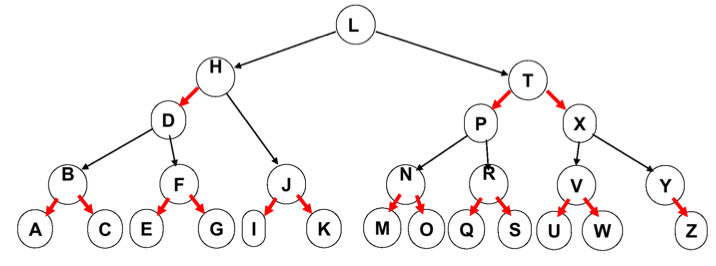

- Auf eine rote Kante muss immer eine schwarze Kante folgen
- Vorteil: Einfachheit von Binärbäumen und Ausgeglichenheit von B-Bäumen
- Weniger gut balanciert als AVL Baum, aber Einfüge und Löschoperationen sind schneller.

#Graphen / Topologien

#Backtracking

#Algorithmen Aufwand

#Suchen / Hashing

#Sortieren 1
##Sortieralgorithmen
###Bubble Sort
- Wiederholtes Vertauschen von Nachbarfeldern
- von links nach rechts
- fängt wieder von links an, wenn 2 Werte vertauscht

Code

	static <T extends Comparable> void BubbleSortG(T[] a){
		for (int k = a.length-1; k > 0; k--) {
			for (int i = 0; i < k; i++) {
				if (a[i].compareTo(a[i+1]) > 0) swap (a, i, i+1);
			}
		}
	}

optimiert:
- springt aus äusserer for wenn kein swap mehr notwendig

Code

	static <T extends Comparable> void BubbleSortG(T[] a){
		for (int k = a.length-1; k > 0; k--) {
			noSwap = true;
			for (int i = 0; i < k; i++) {
				if (a[i].compareTo(a[i+1]) > 0) {
					swap (a, i, i+1);
					noSwap = false;
				}
			}
			if (noSwap) break;
		}
	}

Aufwand:
Best Case: O(N)
Average Case: O(N^2)
Worst Case: O(N^2)

###Selection Sort
####Idee
- Teile die zu sortierenden Elemente in 2 Bereiche auf
- Füge des kleinste Element der unsortierten Elemente an das Ende der sortierten Elemente

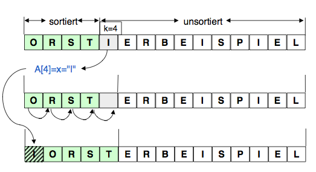

Code

	static void SelectionSort(char[] a){
		for (int k = 0; k < a.length; k++){
			int min = k;
			for (int i = k+1; i < a.length; i ++) {
				if (a[i] < a[min]) min = i;
			}
			if (min != k) swap (a, min, k);
		}
	}

Aufwand: O(N^2)
Vorteil: Weniger Swap-Aufrufe als bei Bubble-Sort
Nachteil: kein Vorteil durch Vorsortierung

###Insertion Sort
####Idee
- Aufteilung in sortierten und unsortierten Bereich
- Das nächste unsortierte Element wird herausgenommen -> es entsteht eine Lücke
- Die Lücke rückt solange nacht links, bis am richtigen Ort ist
- Dort wird sie eingefüllt

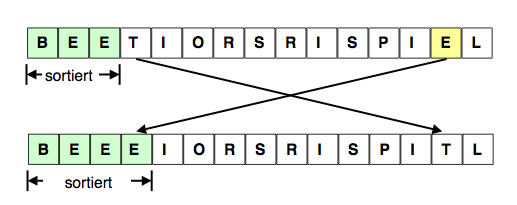

Code

	static void InsertionSort(char[] a){
		for (int k = 1; k < a.length; k++) {
			if (a[k] < a[k-1]){
				char x = a[k];
				int i;
				for (i = k; ((i > 0) && (a[i-1] > x));i--) {
					a[i] = a[i-1];
				}
				a[i] = x;
			}
		}
	}

Vorteile:
- Gerinngere Laufzeit als Insertion-Sort bei vorsortierter Liste
- Durchschnittlich nur halbe Anzahl Vergleiche vgl. mit Insertion Sort
Nachteile:
- Mehr Swaps als Insertion-Sort

###Anwendung Selection - Insertion
Selection:
- Lange Datensätze
- Völlig unsortierte Daten

Insertion:
- Kurze Datensätze
- Gut vorsortiert

#Soriteren 2

#Speicherverwaltung

#Parsing